# Hey 👋 What's up?

I'm Daniel, a Backend Developer from Manaus, Brazil, passionate about creating scalable and maintainable web applications. Currently working with payments.

## About me

💼 Currently working at IKT - Instituto Kodigos de Tecnologia  
🎓 Software Engineering Student at UFAM  
🌱 Focused on microservices architecture and clean code  
🧠 Applying DDD (Domain-Driven Design) to model complex domains and align software with business  
🚀 Building scalable solutions for e-commerce and industrial management  

## Techs and tools

### Frontend & Backend

  
  
  
  
  
    
  
  
  
  
  
  
  
  
  
  
    
  
  
  

### Databases

  
  
  
  
  
  
  

### Tools & Others

  
  
  
  
  
  
  
  
  

## Recent Projects

🔗 **MyTinyURL** - URL shortener with advanced features (Node.js, React, TypeScript)  
🛒 **Crudify** - Modern shopping list manager (NestJS, Next.js, PostgreSQL)  
🛍️ **E-commerce Platform** - Scalable green economy marketplace (Angular, React, AdonisJS)

## Contact

  
  
  

---

